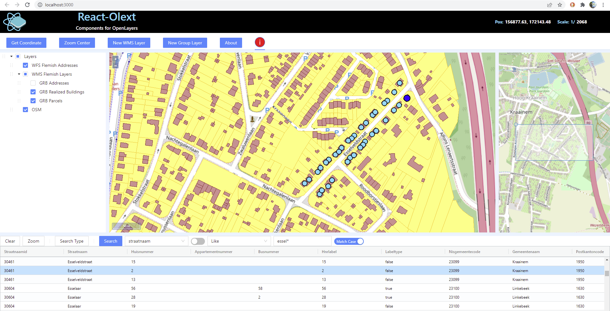
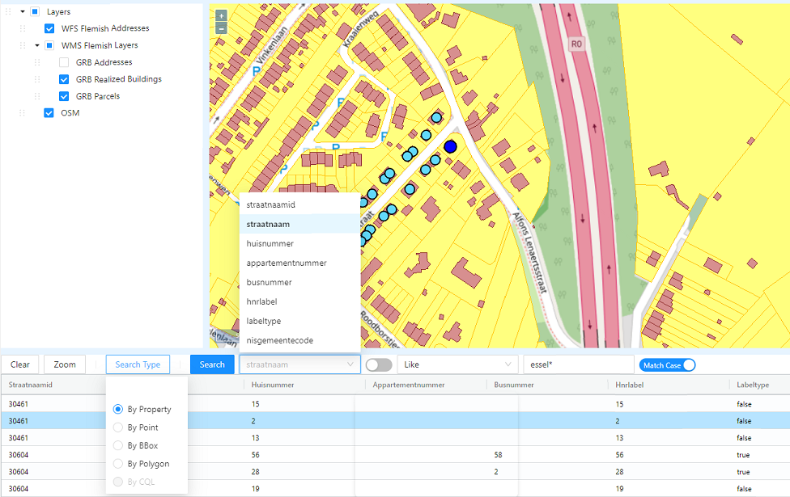
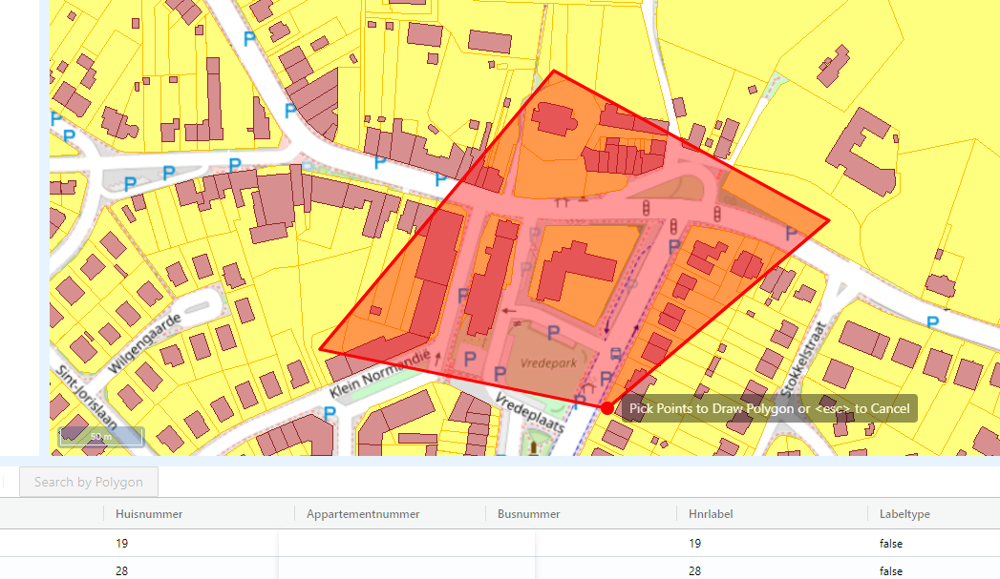
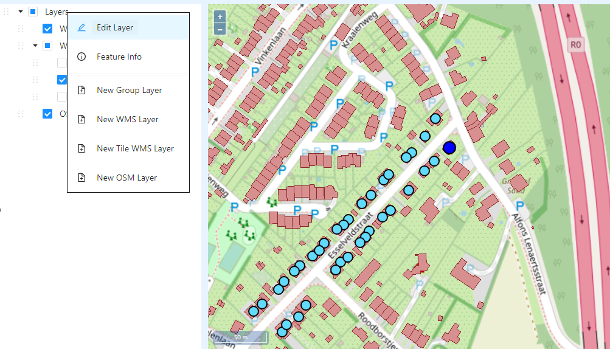
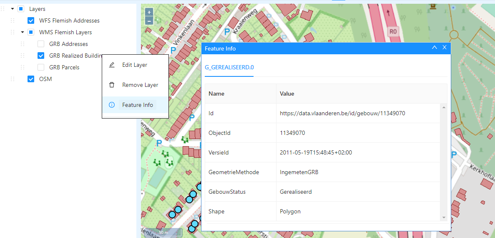
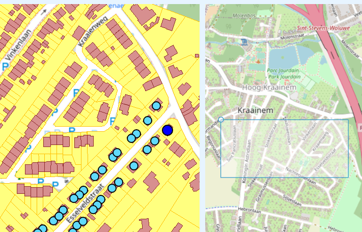

<h2>[1] About</h2>

    <i><b>React-OlExt, the React OpenLayers Extension</b></i> is a Open Source Toolkit that provides collection of components to build a 
    professional Map Application. Its implementation is based on <a href="https://openlayers.org/">OpenLayers</a>, 
    <a href="https://ant.design/">Ant Design</a> and <a href="https://reactjs.org/">React</a> library.
    With a few lines of code you will be able to create a powerfull Map application.

    React-OlExt is under the MIT License, which allow you to develop open-source or commercial applications 
    free of charge and modify the source code as well.

    <b>React-OlExt 0.1</b> is the first base version which uses currently the versions OpenLayers 6.13 and React 17.0.2.

    For a complete description of all components with a LIVE CODE EDITOR, check our 
    <a href="https://mapuiextensions.github.io/react-olext.github.io/en/v0.1/apidoc/">
        API Documentation
    </a>.

    For the source code of some application examples, check our 
    <a href="https://github.com/MapUIExtensions/react-olext-examples">
        examples
    </a>.

<h2>[2] UI Components</h2>

    As shown in the figure below, some included components are: Layer Tree, WFS Feature Grid, WMS Get Feature Info, Overview Map, etc.
    Click in the link <a href="https://mapuiextensions.github.io/react-olext.github.io/en/v0.1/examples/basic-app/index.html">Basic React-OlExt Application</a> to access this application on-line. The source code for this application can be found 
    </a href="https://github.com/MapUIExtensions/react-olext-examples/tree/main/basic-app">here.</a>

    There are hundreds of UI components ready to be used or to be extended.
    For the complete list and description of all components, check the section 
    <a href="https://mapuiextensions.github.io/react-olext.github.io/en/v0.1/apidoc/#/UI%20Components">UI Components</a>: there you can also find the usage of 
    each component with description of the parameters and a LIVE EDITOR on where you can modify the code and see interactively the result.

<h3>[2.1] WFS Feature Grid </h3>

 The WFS Feature Grid allows to retrieve features using the standard WFS GetFeature request.

Some of the functionalities are:

<ul>
    <li>Build complexes queries using several OGC operators: Equal To, Like, Greater Than, Less Than, etc.</li>
    <li>Build complexes queries using OGC spatial operators: Filter by Polygon, Bounding Box, etc.</li>
    <li>The Grid column names are automatically retrieved from WFS query</li>
    <li>Highlight in the map the selected feature in Grid (selection of multiple rows are possible)</li>
    <li>Zoom in the map to the selected feature(s) in the Grid or Zoom to all retrieved features</li>
    <li>Clear in the map the selected feature(s) in the Grid or clear all the retrieved features</li>
    <li>Etc.</li>
</ul>

    In the figure below, as result of the option "Search by Polygon",
    the user is defining a polygon area to retrieve all the addresses inside it.

<h3>[2.2] Tree Layer </h3>

 
    The Tree Layer will allow the user to show/hide the configured layers in the map. Additionally, this UI component provides
    a powerfull context menu once the user right clicks in the tree node representing the layer. The context menu will provide
    the following functionalities:

<ul>
    <li>Edit the layer: rename, change opacity, style, etc...</li>
    <li>Creation of different types of layers: Group Layer, OSM, WMS Layer, Tile WMS Layer</li>
    <li>WMS Get Feature info to retrieve the attributes from the feature picked in the map</li>
    <li>Remove Layer</li>
    <li>Clear Layer (for vector layer)</li>
    <li>Etc...</li>
</ul>

    As show in the figure below, the "Feature Info" option present in the context menu will:

<ul>
    <li>Request the user to select the feature in the map</li>
    <li>Once the feature is selected, a dialog will be shown with all the attributes for the selected feature</li>
</ul>

<h3>[2.3] Overview Map </h3>

    This control is a child map with a view in a large area of the map, allowing a better map navigation.
    The dragging box present in the overview map represents the area of the parent map 
    (See figure below, map in the right side presenting a dragging box).
    This control has the following properties:

<ul>
    <li>If the user pan the overview map (dragging the box to a different position), the parent map will also be re-centered accordinlgy.</li>
    <li>Conversely, if the user pan the parent map, the overview map will be re-centered accordingly.</li>
    <li>If the user click a point in the overview map outside the dragging box:</li>
    <ul>
        <li>The overview map will be re-centered in the clicked point</li>
        <li>The parent map will be re-centered accordingly</li>
    </ul>
</ul>

